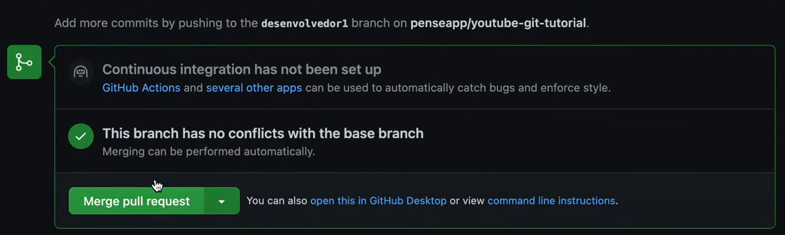

# ADS - Prática de HTMl e CSS (SAD - HTMl and CSS Practice)

## Conteúdo (Table of Contents)

- [ADS - Prática de HTMl e CSS (SAD - HTMl and CSS Practice)](#ads---prática-de-html-e-css-sad---html-and-css-practice)
  - [Conteúdo (Table of Contents)](#conteúdo-table-of-contents)
  - [Português (Portuguese)](#português-portuguese)
    - [Sobre](#sobre)
    - [Instruções para colaboração](#instruções-para-colaboração)
      - [Instalar o VSCode](#instalar-o-vscode)
      - [Instalar o git](#instalar-o-git)
      - [Cadastrar-se no GitHub](#cadastrar-se-no-github)
      - [Passo a passo](#passo-a-passo)
  - [English (Inglês)](#english-inglês)
    - [About](#about)
    - [How to contribute](#how-to-contribute)
      - [Install VSCode](#install-vscode)
      - [Install Git](#install-git)
      - [Register on GitHub](#register-on-github)
      - [Step by step](#step-by-step)
  - [Referências (References)](#referências-references)

## Português (Portuguese)

### Sobre

Projeto em grupo com alunos de análise e desenvolvimento de sistemas, para praticar os básicos de desenvolvimento web (HTMl e CSS) e colaboração no GitHub.

### Instruções para colaboração

#### Instalar o VSCode

- Baixe o VSCode no site oficial: [Link para download do VSCode](https://code.visualstudio.com/)

#### Instalar o git

- Você precisa ter o `git` na sua máquina para que possa contribuir com o projeto.
- O `git` é um sistema de controle de versão, que permite que você faça alterações no projeto localmente (na sua máquina).
  - `Repositório` é uma pasta, onde você armazena o projeto.
  - O processo de salvar uma alteração é chamado de `commit`.
- Você também tem a possibilidade de subir essas alterações para um repositório remoto (na "nuvem"), como o `GitHub`.
- O `git` fornece um histórico de `commits` no projeto, permitindo voltar para uma versão anterior, caso necessário.
- **Exemplos:** Você faz um `commit` no projeto, com uma nova `feature` que faz ele parar de funcionar. Ao perceber isso, caso não tenha o `git`, você teria que consertar o projeto manualmente. Com o `git`, você pode voltar para a versão anterior do projeto que estava funcionando, e então continuar a trabalhar. Também pode acabar deletando um arquivo sem querer, e com o `git`, você pode voltar para antes de ter deletado o arquivo.
  - `Feature` é uma funcionalidade do projeto, como por exemplo: "Adicionar um botão de login".
- Caso tenha dificuldades para instalar, siga um tutorial, como o que está disponível no link abaixo:
  - [Como instalar o GIT no Windows (Passo a passo!)](https://dicasdeprogramacao.com.br/como-instalar-o-git-no-windows/)

> **Nota:** Se você estiver usando outro sistema operacional, como Linux ou Mac, basta pesquisar por um tutorial adequado para ele.

#### Cadastrar-se no GitHub

- Você precisa ter uma conta no `GitHub` para que possa contribuir com o projeto.
- O `GitHub` é uma plataforma de hospedagem de `repositórios`.
- Nele, você pode subir projetos que possuem `git` iniciado, e compartilhá-los com outras pessoas.
- Também pode colaborar com projetos de outras pessoas, como é o caso do projeto que estamos trabalhando.
- Acesse o site oficial do `GitHub` e crie uma conta: [Link para o site oficial do GitHub](https://github.com/)

#### Passo a passo

Primeiro tenha em mente que é possível fazer tudo pelo VSCode, que tem um plugin que já vem nele, bem completo para lidar com o `GitHub`, conforme a figura abaixo. Mas passarei os comandos no terminal para que você possa se acostumar com eles.

- Abra o terminal e vá até o lugar onde pretende salvar o repositório do projeto

~~~bash
cd <caminho-para-o-local>
~~~

> **Nota:** Você pode usar o comando `pwd` para saber em qual pasta você está no momento. Também pode acessar manualmente a pasta, clicar com o botão direito e aí sim abrir o terminal nela para digitar os próximos comandos.

- Clone o repositório para sua máquina

~~~bash
git clone git@github.com:rodrigomarchisilva/ads-html-and-css-practice.git
~~~

- Entre na pasta do projeto

~~~bash
cd ads-html-and-css-practice
~~~

- Abra o projeto no VSCode

~~~bash
code .
~~~

- Verifique se está na branch `main`
  - A partir desse ponto, você pode usar o terminal do próprio VSCode, ou o terminal do seu sistema operacional.
  - Para usar o terminal do VSCode, clique em `Terminal > Novo Terminal` no menu superior, ou aperte `Ctrl + '` no `Windows` ou `Ctrl + Shift + '` no `Linux` ou `Mac`.

~~~bash
# para mostrar todas as branches remotas e locais
git branch -a

# para mostrar todas as branches locais com o asterisco na branch atual
git branch

# para mudar para a branch main
git checkout main
~~~

> **Nota:** **Branch** é uma ramificação do projeto, onde você pode fazer alterações sem afetar o projeto principal, que estará em outra **branch**, geralmente a `main`. Por exemplo, você pode criar uma **branch** para fazer uma nova `feature`, e quando terminar, pode juntar essa **branch** com a **branch** principal, sem quebrar o projeto. Assim, várias pessoas podem trabalhar em diferentes **branches** ao mesmo tempo, sem afetar o projeto principal.

- Verifique se a branch `main` está atualizada em relação ao remoto

~~~bash
# na primeira vez, é necessário especificar o nome do remoto e a branch
git pull origin main

# depois de já ter feito o pull uma vez, o remoto já está configurado e a branch considerada é a atual
git pull
~~~

> **Nota:** **Remoto** é o endereço do repositório que está na "nuvem", no `GitHub`. O `remoto` principal já vem com o nome `origin` configurado, mas você pode mudar esse nome para o que quiser, assim como pode adicionar um novo `remoto` com outro nome, pra subir o projeto para outro lugar, por exemplo. **Local** é o repositório que está na sua máquina. Quando você faz um `pull` (puxar), você está "puxando" as alterações do repositório remoto para o local. Quando você faz um `push` (empurrar), você está "empurrando" as alterações do repositório local para o remoto.

- Crie uma branch com o nome da sua feature e trabalhe nela. Aqui não há certo ou errado, cada projeto tem suas regras, então siga o padrão se já existir. Mas aqui estão algumas sugestões:

~~~bash
# especificando que é uma feature
git checkout -b feature/<nome-da-feature>

# especificando o nome do colaborador
git checkout -b <nome-do-colaborador>/<nome-da-feature>

# ambos
git checkout -b <nome-do-colaborador>/feature/<nome-da-feature>

# exemplo
git checkout -b rodrigo-marchi/feature/login-page
~~~

- Faça um `commit` a cada alteração que fizer, porque se fizer muitas alterações e só depois der `commit` (famoso "commit bomba"), pode ser que você perca o que fez, caso algo dê errado.

~~~bash
# verifique o status do projeto
git status

# adicione as alterações individualmente
git add <nome-do-arquivo>

# ou adicione todas as alterações
git add .

# faça o commit
git commit -m "Mensagem do commit"
~~~

> **Nota:** A mensagem do commit deve ser em inglês, com o verbo no infinitivo, e deve descrever o que foi feito. Por exemplo: "Add login page", "Fix login page", "Add login button", "Fix login button". Existe um padrão de mensagens de commit, que é o [Conventional Commits](https://www.conventionalcommits.org/en/v1.0.0/), que não é obrigatoriedade, mas é uma boa prática, usado por muitas empresas. Desenvolvi um arquivo com os padrões de commit que utilizo mais, incluindo emotes, que você pode acessar [aqui](https://github.com/rodrigomarchisilva/marchi_notes/blob/main/environment/git/conventional_commits.md).

- Faça um push para a branch criada a cada `commit` que fizer, assim, caso o computador dê algum problema, você não perde o que fez.

~~~bash
# no primeiro push você precisa especificar o nome do repositório remoto e a branch
git push -u origin feature/<nome-da-feature>

# depois de já ter feito o push uma vez, ele considera o remoto que você especificou e a branch que você está
git push
~~~

- Abra um `pull request` com destino na branch `main`
  - Esse processo é feito pelo próprio `GitHub`, então você não precisa fazer nada no terminal, mas tem como fazer pelo terminal ou VSCode também.

  
  

  - Se tudo estiver OK, o seu `pull request` será aceito e a sua feature será `mergeada` com a branch `main` automaticamente.

  

  - Se alguém tiver atualizado o mesmo arquivo que você mexeu na sua branch e atualizou a branch `main`, você terá que resolver os conflitos antes do `merge` ser feito.

  

> **Nota:** **Pull request** é uma solicitação para que o seu código (branch) seja incorporado ao projeto (branch) principal. **Merge** é a incorporação do seu código (branch) ao projeto (branch) principal.

- (Ocasional) Resolva os conflitos, se houver
  - O `merge` ficará bloqueado até que você resolva os conflitos.
  - No seu VSCode, aperte `Ctrl + Shift + P` e digite `settings`, e selecione a opção `Preferences: Open Settings (JSON)`.
  - Inclua a seguinte linha no arquivo que será aberto: `"git.mergeEditor": true`.
  - Isso permitirá que você resolva os conflitos lado a lado, no VSCode, de maneira bem clara.
  - Agora saia da sua branch e volte para a `main`, e faça um `pull` para atualizar o projeto local: `git checkout main` e `git pull`.
  - Você pode fazer o pull na sua branch direto também: `git pull origin main`.
  - Se saiu da sua branch, volte nela com `git checkout <nome-da-sua-branch>` e faça um `git merge main`.
  - Isso irá gerar um arquivo com os conflitos, que você pode resolver no VSCode.
  - Abra o arquivo com os conflitos (caixas azuis) e resolva-os.
  - Você pode apagar o que não quiser deixando a caixinha circulada em vermelho desmarcada, deixar os dois, ou fazer uma mistura dos dois.
  
  - Tem como selecionar os códigos que manterá pela interface do VSCode, ou editar na aba de `results` (caixa amarela).
  - Clique em `Accept merge` (caixa verde) para salvar as alterações, faça um `commit` do `merge` e um `push` para subir as alterações para o `GitHub`.
  - Pronto! Agora o seu `pull request` pode ser aceito normalmente.

> **Nota:** É possível resolver os conflitos pelo próprio `GitHub`, mas pelo VSCode é mais fácil de visualizar as alterações, principalmente em arquivos grandes ou com muitos conflitos.

- Após o `merge`, você pode deletar a sua branch, pois ela já foi incorporada ao projeto principal.

~~~bash
# verifique em qual branch você está
git branch

# mude para a branch main
git checkout main

# atualize a branch main
git pull

# delete a sua branch
git branch -d <nome-da-sua-branch>

# exemplo
git branch -d rodrigo-marchi/feature/login-page
~~~

> **Nota:** Tem como deletar a branch diretamente no `GitHub` também. Nesse caso, faça o `pull` local na branch `main` depois de deletar a branch remota.

## English (Inglês)

### About

Project in group with systems analysis and development students, to practice basics of web development (HTMl and CSS) and GitHub collab.

### How to contribute

#### Install VSCode

- Download and install [VSCode](https://code.visualstudio.com/).

#### Install Git

- You need to have `git` installed on your machine to be able to contribute to the project.
- `Git` is a version control system, which allows you to make changes to the project locally (on your machine).
  - `Repository` is a folder, where you store the project.
  - The process of saving a change is called `commit`.
- You also have the possibility of uploading these changes to a remote repository (in the "cloud"), such as `GitHub`.
- `Git` provides a history of `commits` in the project, allowing you to go back to an earlier version, if necessary.
- **Examples:** You make a `commit` in the project, with a new `feature` that makes it stop working. When you realize this, if you don't have `git`, you would have to fix the project manually. With `git`, you can go back to the previous version of the project that was working, and then continue working. You can also end up deleting a file by mistake. With `git`, you can go back to the previous version of the project that had the file, and then continue working.
  - `Feature` is a new functionality that you add to the project. For example, a new page, a new button, a new form, etc.
- If you have any issues, you can ask for help through `whatsapp` or `discord`, or follow a tutorial on the internet, like [this one](https://www.youtube.com/watch?v=4xqVv2lTo40).

> **Note:** If you are using another operating system, such as Linux or Mac, just search for a tutorial appropriate for it.

#### Register on GitHub

- You need to have a `GitHub` account in order to contribute to the project.
- `GitHub` is a platform for hosting `repositories`.
- On it, you can upload projects that have `git` initialized, and share them with other people.
- You can also collaborate on other people's projects, as is the case with the project we are working on.
- Access the official `GitHub` website and create an account: [Link to the official GitHub website](https://github.com/)

#### Step by step

- First have in mind that it is possible to do everything through VSCode, which has a plugin that already comes with it, very complete to deal with `GitHub`, as shown in the figure below. But I will pass the commands on the terminal so that you can get used to them.

- Open the terminal and go to the place where you want to save the project repository.

~~~bash
cd <path-to-folder>
~~~

> **Note:** You can use the `pwd` command to know which folder you are in at the moment. You can also manually access the folder, right-click and then open the terminal in it to type the next commands.

- Clone the repository to your machine.

~~~bash
git clone git@github.com:rodrigomarchisilva/ads-html-and-css-practice.git
~~~

- Go to the project folder.

~~~bash
cd ads-html-and-css-practice
~~~

- Open the project in VSCode.

~~~bash
code .
~~~

- Verify that you are in the `main` branch.
  - From this point, you can use the VSCode terminal, or the terminal of your operating system.
  - To use the VSCode terminal, click on `Terminal > New Terminal` in the top menu, or press `Ctrl + '` on `Windows` or `Ctrl + Shift + '` on `Linux` or `Mac`.

~~~bash
# to show all branches, remote and local
git branch -a

# to show only local branches, with an asterisk next to the current branch
git branch

# to switch to main branch
git checkout main
~~~

> **Note:** **Branch** is a branch of the project, where you can make changes without affecting the main project, which will be in another **branch**, usually the `main`. For example, you can create a **branch** to make a new `feature`, and when you finish, you can join that **branch** with the main **branch**, without breaking the project. So, several people can work on different **branches** at the same time, without affecting the main project.

- Verify that the `main` branch is updated in relation to the remote.

~~~bash
# first time, you need to specify the remote name and the branch
git pull origin main

# after you have already done the pull once, the remote is already configured and the branch considered is the current one
git pull
~~~

> **Note:** **Remote** is the address of the repository that is in the "cloud", on `GitHub`. The main `remote` already comes with the name `origin` configured, but you can change that name to whatever you want, as well as you can add a new `remote` with another name, to upload the project to another place, for example. **Local** is the repository that is on your machine. When you do a `pull`, you are "pulling" the changes from the remote repository to the local. When you do a `push`, you are "pushing" the changes from the local repository to the remote.

- Create a branch with the name of your feature and work on it. There is no right or wrong here, each project has its own rules, so follow the pattern if there is already one. But here are some suggestions:

~~~bash
# specify it is a feature
git checkout -b feature/<feature-name>

# specify the name of the collaborator
git checkout -b <collaborator-name>/feature/<feature-name>

# both
git checkout -b <collaborator-name>/feature/<feature-name>

# example
git checkout -b rodrigo-marchi/feature/login-page
~~~

- Make a `commit` for each change you make, because if you make many changes and only then do a `commit` (famous "commit bomb"), you may lose what you did if something goes wrong.

~~~bash
# verify the status of the files
git status

# add a single file to the commit
git add <file-name>

# or add all files to the commit
git add .

# make the commit
git commit -m "Commit message"
~~~

> **Note:** The commit message must be in English, with the verb in the infinitive, and must describe what was done. For example: "Add login page", "Fix login page", "Add login button", "Fix login button". There is a commit message standard, which is [Conventional Commits](https://www.conventionalcommits.org/en/v1.0.0/), which is not mandatory, but is a good practice, used by many companies. I developed a file with the commit patterns that I use most, including emojis, which you can access [here](https://github.com/rodrigomarchisilva/marchi_notes/blob/main/environment/git/conventional_commits.md).

- Make a `push` to the branch you created for each `commit` you make, so that if the computer breaks, you don't lose what you did.

~~~bash
# in the first time, you need to specify the remote name and the branch
git push -u origin feature/<feature-name>

# after you have already done the push once, the remote is already configured and the branch considered is the current one
git push
~~~

- Open a `pull request` with destination in the `main` branch
  - This process is done by `GitHub` itself, so you don't need to do anything in the terminal, but you can do it in the terminal or VSCode too.

  
  

  - If everything is OK, your `pull request` will be accepted and your feature will be `merged` with the `main` branch automatically.

  

  - If someone has updated the same file that you changed in your branch and updated the `main` branch, you will have to resolve the conflicts before the `merge` is done.

  

> **Note:** **Pull request** is a request to incorporate your code (branch) into the main project (branch). **Merge** is the incorporation of your code (branch) into the main project (branch).

- (Ocasional) Solve the conflicts, if there are any
  - The `merge` will be blocked until you solve the conflicts.
  - In your VSCode, press `Ctrl + Shift + P` and type `settings`, and select the option `Preferences: Open Settings (JSON)`.
  - Include the following line in the file that will be opened: `"git.mergeEditor": true`.
  - This will allow you to solve the conflicts side by side, in VSCode, in a very clear way.
  - Now leave your branch and return to the `main`, and do a `pull` to update the local project: `git checkout main` and `git pull`.
  - You can do the pull on your branch directly too: `git pull origin main`.
  - If you left your branch, return to it with `git checkout <your-branch-name>` and do a `git merge main`.
  - This will generate a file with the conflicts, which you will have to solve.
  - Open the file with the conflicts (blue boxes) and solve them.
  - You can now delete what you don't want, leaving the red circle box unchecked, leave both, or make a mixture of the two.
  - 
  - There is a way to select the code that you want to keep, or edit the code directly in the `results` tab (yellow box).
  - Click in `Accept merge` (green box) to save the changes, do a `commit` of the `merge` and a `push` to upload the changes to `GitHub`.
  - And that's it! Now your `pull request` can be accepted normally.

> **Note:** You can solve the conflicts directly on `GitHub`, but it is easier to visualize the changes in VSCode, especially in large files or with many conflicts.

- After the `merge`, you can delete your branch, because it has already been incorporated into the main project.

~~~bash
# verify which branch you are in
git branch

# switch to the main branch
git checkout main

# update the main branch
git pull

# delete your branch
git branch -d <branch-name>

# example
git branch -d rodrigo-marchi/feature/login-page
~~~

> **Note:** You can delete the branch directly on `GitHub` too. In that case, do a `pull` locally on the `main` branch after deleting the remote branch.

## Referências (References)

[#6 GIT - Merge conflicts | Como resolver os conflitos do jeito mais simples (ATUALIZADO 2022)](https://www.youtube.com/watch?v=-xxhkAPJZPY)
